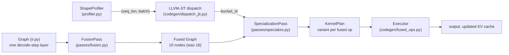

# DRAKE Architecture

## The problem

Ahead-of-time inference compilers (TVM, XLA, TensorRT, `torch.compile`) pick
one fusion plan and one kernel schedule per shape signature, decided at
compile time. That is a fine assumption for vision models with fixed input
sizes. It is the wrong assumption for autoregressive LLM decoding: every
single step re-invokes the same graph with a `(batch, seq_len)` that grew by
one token since the last call. A schedule tuned for `seq_len=16` (register-
resident, no tiling needed) is not the schedule you want at `seq_len=8000`
(must tile against shared memory / L2), and a real serving system spends its
entire life somewhere on that curve, not at one fixed point.

DRAKE's premise: don't pick one schedule. Profile the shapes you actually
see, bucket them, and compile/specialize lazily, per bucket, the first time
each bucket is hit. Never pay for a variant a workload never visits.

## Pipeline

## Components

**`ir.py`** — a graph IR scoped to exactly one decode-step transformer
layer: rmsnorm, qkv projection, rotary embedding, KV-cache append, attention,
output projection, and the FFN block. Shapes are symbolic (`("batch",
"seq_len", "n_heads", "head_dim")`), resolved against a concrete `dims` dict
at analysis or execution time — this is what lets one `Graph` describe every
shape a decode step will ever see.

**`passes/fusion.py`** — pattern-matches contiguous op-kind sequences
and merges them into `FusedOp` nodes, but only when a connectivity check
confirms it's a genuine dependency chain (not a coincidental kind match).
The one novel pattern: `kv_cache_update -> attn_qk -> attn_softmax ->
attn_av` becomes a single `fused_attention_kvupdate` node. This is the
KV-cache-aware fusion: the freshly appended K/V for the new token is
produced and immediately consumed by attention without round-tripping
through HBM in between — the same principle FlashDecoding and paged-attention
kernels use in production inference engines.

Savings are computed analytically: for every tensor produced inside a fused
group and consumed later in the same group, `traffic_saved_bytes` checks
whether anything *outside* the group still needs it (using the original,
pre-fusion graph's consumer counts — the fused graph's own top-level ops no
longer expose those tensors as inputs, so consumer-counting against it would
undercount). Purely internal tensors save a full write+read (2x); tensors
that are also graph outputs (like the updated KV cache) still save the
internal read-back (1x).

**`passes/specialize.py`** — given a `ShapeBucket`, picks a
`KernelVariant` per fused op: vectorized attention below 128 tokens, tiled
(tile_size 64 or 128) above that; single-block or batch-blocked matmul
depending on batch size. `classify()` here is the single source of truth for
bucket boundaries, shared with the LLVM codegen below.

**`codegen/dispatch_jit.py`** — compiles the bucket classifier itself
to LLVM IR via `llvmlite` (branch-free: a chain of `icmp sge` + `zext` +
`add` per boundary) and JITs it to native code, called through `ctypes`. The
point: the dispatch decision that gates every fused kernel on the hot
decode-loop path is compiled code, not an interpreted Python if-chain.
`tests/test_dispatch_jit.py` checks the JIT'd function against the Python
reference classifier over a dense grid of `(seq_len, batch)` pairs.

**`codegen/fused_ops.py`** — real numpy implementations of every op
(rmsnorm, rotary embedding, causal attention, KV-cache concat, gelu, etc.),
plus a generic executor that runs a `Graph` — fused or not — by recursing
into a `FusedOp`'s original sub-ops. This is what makes
`test_fusion_is_semantics_preserving` meaningful: the fused graph and the
original 16-op graph must produce bit-identical output.

**`runtime.py`** — `DrakeEngine` wires all of the above into a
per-step `.step(x, cache_k, cache_v)` call: profile the shape, classify it
via the JIT'd dispatcher, look up or lazily build the `KernelPlan` for that
bucket, execute, and report the traffic saved.

## What's real vs. what's a stand-in

- **Real and load-bearing:** the IR, the fusion legality/connectivity check,
  the analytic HBM-traffic cost model, the shape-bucket specializer, and the
  LLVM IR generation + JIT execution (this is genuinely compiled and
  genuinely executed, not a mock).
- **Stand-in, by design:** `fused_ops.py` executes on numpy/CPU so the whole
  pipeline runs end-to-end without a GPU. It proves *correctness*
  (fusion doesn't change results) but is not where a wall-clock speedup
  claim would come from — CPU/numpy doesn't have the HBM-bandwidth
  bottleneck that motivates fusion on a GPU in the first place.

## Natural next step

Swap `codegen/fused_ops.py` for a Triton (or CUTLASS) backend that emits one
real kernel per `KernelVariant`, keeping `ir.py`, `passes/fusion.py`, and
`passes/specialize.py` untouched. At that point the analytic
`traffic_saved_bytes` numbers can be checked against measured GPU wall-clock
and achieved-bandwidth numbers on real hardware.
